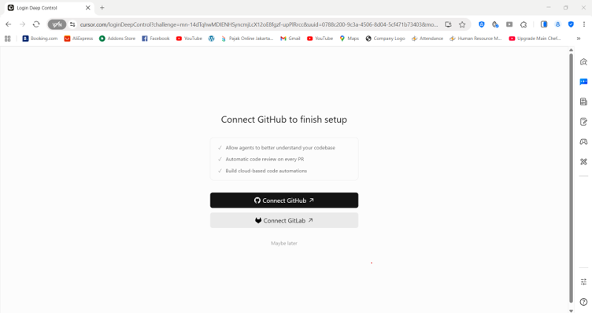
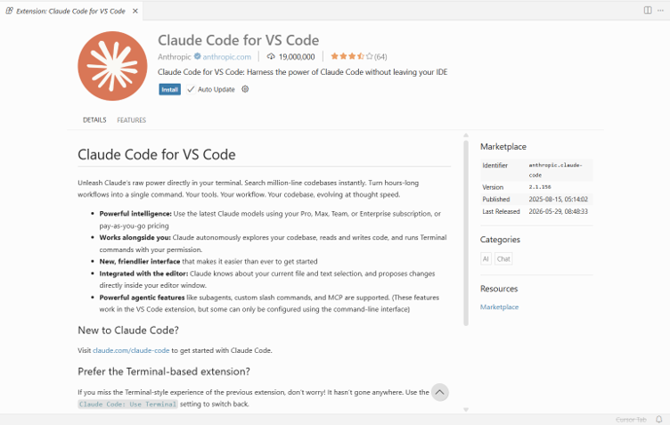
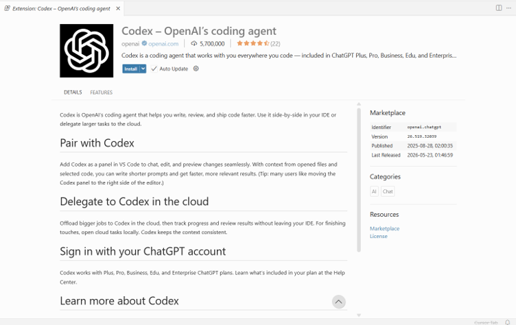
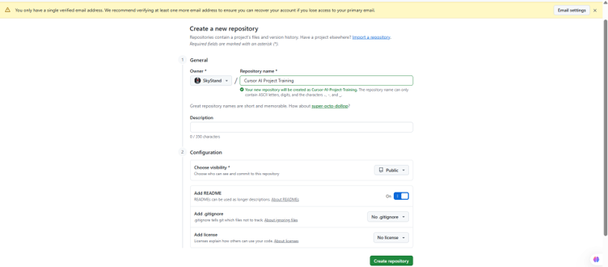
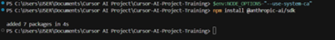
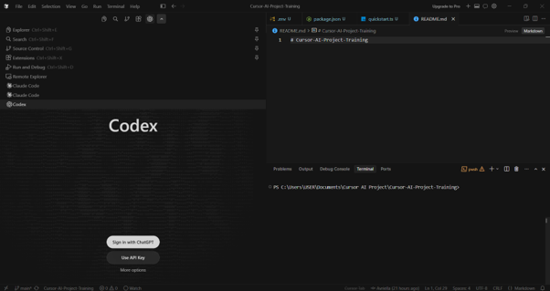

# Cursor AI Setup Documentation

## Overview

This repository documents the process of setting up an AI-assisted development environment using Cursor IDE, Claude Code, and Codex. It includes installation steps, environment configuration, GitHub integration, troubleshooting notes, and references to relevant documentation.


## Tools

### Development Tools
- Cursor IDE
- Git
- GitHub

### AI Extensions
- Claude Code
- Codex

### Runtime & Package Management
- Node.js LTS
- npm


## Installation

### 1. Install Cursor IDE

Download Cursor IDE from the official website:

- https://cursor.com/download

Alternatively, install it using Windows Package Manager:

```bash
winget install -e --id Anysphere.Cursor
```

I chose Windows Package Manager because it simplifies software installation, version management, and future updates through the command line.

### 2. Account Setup

After installing Cursor:

1. Launch Cursor IDE
2. Sign in using a GitHub account
3. Verify the account through email authentication
4. Complete the initial setup process




### 3. Install AI Extensions

Open the Extensions Marketplace:

```text
View → Extensions
```

Install the following extensions:

- Claude Code
- Codex

After installation, sign in to each service using the corresponding account credentials.

Resources:

- Claude: https://platform.claude.com/
- Codex: https://chatgpt.com/codex/





---

## GitHub Setup

### 1. Create a Repository

Create a new public GitHub repository and clone it locally:

```bash
git clone <repository-url>
```



### 2. Open the Repository in Cursor

Open the cloned repository in Cursor IDE.

Verify that the repository is connected to the correct remote:

```bash
git remote -v
```

If no remote repository is configured:

```bash
git remote add origin <repository-url>
```

### 3. Commit and Push Changes

Save project updates using Git:

```bash
git add .
git commit -m "commit message"
git push
```

This workflow tracks project changes and synchronizes them with GitHub.

---

## Environment Configuration

### 1. Install Node.js

Install the latest Node.js release:

```bash
winget install -e --id OpenJS.NodeJS
```

Or install the Long-Term Support (LTS) version:

```bash
winget install -e --id OpenJS.NodeJS.LTS
```

I selected the LTS version because it provides better long-term stability and compatibility with third-party packages.

Verify the installation:

```bash
node -v
npm -v
```

### 2. Configure Claude Quickstart

Create a sample project and install the Anthropic SDK:

```bash
mkdir claude-quickstart
cd claude-quickstart

npm init -y
npm pkg set type=module
npm install @anthropic-ai/sdk
```



### 3. Configure Codex

Access Codex through the Cursor sidebar and sign in using an OpenAI account.



---

## Documentation References

### Claude Documentation

https://platform.claude.com/docs/en/get-started

### Codex Documentation

https://developers.openai.com/codex/ide

---

## Issues Encountered & Troubleshooting

### 1. npm SSL Certificate Error

While installing the Anthropic SDK, npm returned the following error:

```bash
UNABLE_TO_VERIFY_LEAF_SIGNATURE

request to https://registry.npmjs.org/@anthropic-ai%2fsdk failed,
reason: unable to verify the first certificate
```

#### Cause

The npm client was unable to verify the SSL certificate chain when connecting to the npm registry.

#### Resolution

I updated the Node.js environment and adjusted npm SSL configuration settings through powershell.

Commands used:

```bash
npm config set strict-ssl false
npm install @anthropic-ai/sdk
```

After applying the configuration changes, the package installation completed successfully.

#### Key Learning

This issue highlighted the importance of understanding SSL certificate validation, package manager configuration, and troubleshooting dependency installation problems in a development environment.

---

## What I Learned

- Installing and configuring AI development tools
- Working with Git and GitHub repositories
- Managing Node.js and npm environments
- Troubleshooting dependency installation issues
- Understanding TypeScript module systems
- Researching and resolving technical problems independently
- Using AI-assisted development workflows

---

## Author

**Avriella Sofianti**
